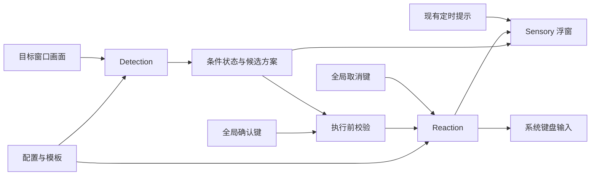

# Detection / Reaction 最小闭环：可行性与实现方案

日期：2026-09-10。性质：设计分析与需求拆分，尚未实现或完成目标应用实测。

## 1. 结论与范围

最小闭环在当前 Rust + Bevy 工程上具备实现基础： **识别屏幕模式 → 条件达成 → 浮窗显示应对方案与快捷键 → 用户按键确认 →
执行可配置键盘宏 → 显示执行结果**。其中，提示更新不需要重建窗口，也不应抢走目标程序的焦点。

结合本会话后续补充的游戏 UI 异步刷新和宏开发体验需求，建议调整为 **Windows 窗口捕获 + 可供执行流程等待的 Detection 条件 + 全局确认/取消快捷键 + 成熟语言 SDK + Nyra 执行服务**。
宏需要支持“执行动作 → 等待可核对的后置条件 → 继续”，不能只依赖预设等待时间。语言优先考察 TypeScript，具体选择尚未定案，见第 10 节。

第 2～9 节保留首次分析的基础方案，其中 JSON 动作列表、单检测器配置及对应拆分属于初版设计；涉及宏表达、运行中检测和调试的建议以第 10 节修订为准。JSON 仍适合配置数据，不再作为复杂宏的首选编写形式。

这是一条有条件可行的路线，不能仅凭系统 API
的存在认定目标应用兼容。正式开发前必须验证两个条件：能否稳定取得目标画面，以及目标程序能否接受所需模拟按键。若任一项失败，应调整目标场景或输入来源，不能通过增加
UI 或配置字段解决。

当前尚未提供首个目标应用、模式样本和实际宏。以下以“窗口化或无边框窗口中的固定位置图标出现”为假设，限制为一个目标窗口、一个条件、一套短宏、用户确认执行。示例中的应用名、坐标、按键和阈值均为占位设计，不代表已确认需求。

首版不包含无用户确认的自动启动、多方案调度、宏录制、自建通用脚本语言、后台窗口输入、跨平台、配置编辑器或热加载。一套方案内部可以等待不同的步骤条件。现有定时提示继续可用，但不能决定应对方案是否允许执行。

## 2. 现有基础与必须改动的接口

以当前源码为准；早期阶段总结存在与现代码不同的内容，例如文本目前已有滚动实现。

| 部分         | 当前基础                                                                                                                                                | 本闭环所需改动                                                              |
|--------------|---------------------------------------------------------------------------------------------------------------------------------------------------------|-----------------------------------------------------------------------------|
| 应用装配     | [main.rs](../src/main.rs) 读取 JSON，创建透明置顶窗口并注册 Sensory                                                                                     | 装配配置、捕获、识别、快捷键和宏执行；统一退出清理                          |
| 配置         | [job.rs](../src/job.rs) 只有 `Tips`、`Tip` 和 `JobConfig`；启动时要求 tips 非空                                                                         | 引入顶层应用配置、条件与宏的关联，允许只有条件方案的配置                    |
| 定时调度     | [job_manager.rs](../src/sensory/job_manager.rs) 按 `interval/showTime` 轮换，通过 `ActiveJobState` 输出数组索引                                         | 保留原有调度；增加一个选择最终展示内容的入口，避免将识别条件硬塞进时间间隔  |
| 浮窗呈现     | [view.rs](../src/sensory/tip_overlay/view.rs) 按提示索引获取文字和颜色                                                                                  | 消费统一展示数据；显示方案、可执行状态、确认键和结果                        |
| 动画和刷新   | [tip_overlay.rs](../src/sensory/tip_overlay.rs) 按资源变化同步 UI；[transition.rs](../src/sensory/tip_overlay/transition.rs) 按提示索引决定是否播放动画 | 改用展示身份和状态；同一方案再次达成也能提醒，采样更新不反复播放动画        |
| 初始化与清空 | `setup_overlay` 直接取 `tips[0]`，且使用列表长度取模；文字同步遇到空状态直接返回                                                                        | 消除空列表索引/取模；无方案时主动清空或展示空闲信息，不能保留旧的可执行提示 |
| 输入与识别   | [Cargo.toml](../Cargo.toml) 尚无专门的屏幕捕获、识别和系统输入依赖                                                                                      | 新增 Windows 适配及小范围图像处理，具体依赖在兼容性验证后确定               |

最小充分改动是增加独立的条件/执行状态与展示适配，而不是重写全部任务系统。当前 `ActiveJob` 中的动画随机状态属于 ROADMAP
已记录的技术债；本任务只处理接入所必需的展示身份和动画触发，不以此为由扩大重构。

## 3. 模块职责与数据流



建议继续使用单 crate，按职责增加模块，不预建插件框架：

- `config`：读取、默认值、版本处理、字段校验和资源路径解析，输出已校验的运行配置。
- `detection`：取得画面、计算匹配结果、维护条件状态。输出不依赖浮窗实体。
- `reaction`：维护候选方案、执行资格及宏运行状态，解释动作列表并管理取消和清理。
- Windows 适配代码：目标窗口身份、捕获、全局快捷键、输入发送。可放在对应模块下，不必先抽象多平台后端。
- `sensory`：从“执行状态、候选方案、定时提示”中选出最终内容，复用现有文字和动画组件。

捕获/识别和宏等待均不能阻塞 Bevy
主循环。捕获工作线程只保留最新观测，丢弃积压画面；宏由单一执行线程顺序执行，等待可被取消信号唤醒。主线程按“接收观测和结果 →
更新条件/执行资格 → 处理确认请求 → 生成展示 → 更新 UI”的顺序处理。取消信号应直接到执行器，不依赖 UI 是否及时刷新。

跨线程消息带目标实例标识、观测时间、条件代次或执行 ID。目标重建后丢弃旧观测，执行结束后丢弃旧运行的迟到消息。无需为首版建立通用事件总线或完整历史数据库。

## 4. Detection：从屏幕模式得到可用条件

### 4.1 首先验证画面来源

建议优先验证 Windows Graphics Capture，按目标窗口获取画面，再裁切 ROI（关注区域）。官方提供按 HWND 创建捕获对象的
`CreateForWindow`，该接口要求 Windows 10 1903
或更高版本；仍须在启动时检查实际捕获支持情况。[Microsoft：CreateForWindow](https://learn.microsoft.com/en-us/windows/win32/api/windows.graphics.capture.interop/nf-windows-graphics-capture-interop-igraphicscaptureiteminterop-createforwindow)

捕获需要自己的帧池、图形资源及尺寸变化处理。建议首版保持捕获用资源与 Bevy 渲染资源分离，裁切后只把小区域读回 CPU，不先做 GPU
共享纹理优化。小 ROI
能减少识别和读回成本，但不意味着底层捕获整窗的成本也按面积等比例下降。官方捕获文档说明了帧生命周期、内容尺寸和设备丢失处理。[Microsoft：Screen capture](https://learn.microsoft.com/en-us/windows/uwp/audio-video-camera/screen-capture)

首轮验证应覆盖：正常前台、移动、遮挡、缩放、最小化、关闭、恢复，以及 Nyra 浮窗是否污染捕获区域。不能把黑图或旧画面当作“不匹配”；无法确认有效性时输出
`Unknown`。首版将目标不在前台、最小化、锁屏或捕获异常统一视为不可执行场景。原型还须核实静止画面时帧时间戳/更新机制，不能只因工作线程仍存活就延长旧画面的有效期。

如果窗口捕获不适用，再比较桌面区域捕获或目标应用公开接口。桌面区域捕获必须处理遮挡和浮窗进入 ROI
的问题。窗口标题、可访问性信息只在其确实表达目标条件时才可替代画面；不预设所有图形应用都暴露所需语义。

### 4.2 首版识别算法

对于固定位置、固定缩放的图标，建议采用固定 ROI 的像素差模板匹配，避免首版引入 OCR 或学习模型。

1. 从已确认条件成立的画面裁出模板，收集不成立及外观相近的负样本。
2. 将采集坐标映射到目标窗口客户区的物理像素；明确客户区、捕获帧边框及 DPI 之间的换算。
3. 首版要求客户区尺寸与配置一致，ROI 与模板同尺寸；变化后进入 `Unknown`，不悄悄缩放模板。
4. 对 ROI 与模板计算 RGB 平均绝对差，定义 `score = 1 - mean(abs(frame - template)) / 255`，范围为 0～1。
5. 分数达到阈值时输出 `Matched`，低于阈值输出 `NotMatched`。分数是相似度，不是条件成立概率。

上述算法是针对假设场景的工程建议。图标位置漂移、动态背景、动画、透明度或 HDR 色彩差异会降低可靠性；如果正负样本分数无法分离，应先换
ROI/模板或缩小显示条件，再决定是否需要带掩码或小范围搜索的匹配算法。

模板与画面统一使用确定的像素格式；首版先验证 SDR、固定 UI 缩放。采集输入默认只在内存处理，不保存、不上传；模板与人工采集样本作为显式提供的本地资源。

### 4.3 稳定触发、时效与重新触发

每次观测至少包含 `targetInstance`、`frameId`、`observedAt`、`status` 和匹配分数。时间使用单调时钟，不能使用 UI 的 `showTime`
判断条件新鲜度。

建议首版规则如下，数值均须通过真实样本调节：

| 事件                                      | 行为                                                           |
|-------------------------------------------|----------------------------------------------------------------|
| 连续 3 次有效采样匹配                     | 建立一个待执行方案，分配新的 `offerId`                         |
| 持续匹配                                  | 更新最新证据时间，不创建新方案，不反复播放提醒动画             |
| 任一次新采样不匹配、不可判定或超时        | 立即撤销执行资格；重新满足需再次稳定匹配                       |
| 按下确认键                                | 对当前 `offerId` 发起一次校验；重复按键不排队                  |
| 校验通过并开始执行                        | 原子地消费本次机会；同一轮持续匹配只能启动一次                 |
| 执行结束、取消或失败                      | 显示结果；不自动重试、不立即恢复该次执行机会                   |
| 执行结束后连续 3 次有效不匹配，且冷却结束 | 允许后续稳定匹配建立下一次机会                                 |
| 捕获失败或失焦                            | 撤销候选；`Unknown` 不算“条件已经解除”，不能用于清除已消费锁存 |

“首次成立去抖”和“失效立即禁用”有意采用不同策略：短时误差可能导致提示暂时不可用，但不会继续让已知失效的条件授权输入。若条件长时间不消失，执行机会不会因冷却到期而重复产生。目标关闭后旧机会失效；重新找到的窗口作为新实例重新观测。

起始采样周期可设为 100 ms、证据有效期 800 ms。3 次连续匹配带来的采样等待通常约 200～300
ms，另外叠加捕获、识别和展示耗时；这只是估算，不能当作实测延迟。无新鲜证据时必须禁用执行；静态画面是否可提供足够新鲜的证据，应在捕获验证阶段解决。

## 5. Reaction：键盘宏选型

本节记录有限动作序列这一初始假设下的选型。后续需求要求运行中等待画面条件，并重视编码、调试体验，因此以下“首版首选”判断已由第 10 节调整，不是当前最终推荐。

### 5.1 配置表达和执行后端是两个问题

“宏可配置、无需编译”不要求必须使用 AutoHotkey。JSON 描述动作、Rust 在运行时解释，同样满足要求；是否热加载是另一个独立需求。另一方面，选择
AutoHotkey 也不自动解决焦点、取消和状态同步。

| 方案                        | 无需编译的方式                 | 优点                                                               | 主要成本                                                 | 建议                                                  |
|-----------------------------|--------------------------------|--------------------------------------------------------------------|----------------------------------------------------------|-------------------------------------------------------|
| JSON 动作列表 + 内置执行器  | 重启后解析配置并逐步执行       | 可静态校验；执行、取消和持键状态都由 Nyra 管理；复用现有 JSON 基础 | 自行实现键位映射、时序和系统输入                         | 首版首选，适合有限键盘动作                            |
| AutoHotkey v2 外部脚本      | 解释器直接加载 `.ahk`          | 已有键盘脚本语法，便于复用成熟脚本和手工调试                       | 分发解释器；脚本生命周期、取消、持键和结果需要跨进程协议 | 已有真实可用 AHK 宏，或近期明确需要分支脚本时优先考虑 |
| JSON 动作列表转 AHK         | 读取 JSON 后生成脚本交给解释器 | 对外仍是结构化配置，可利用 AHK 输入实现                            | 同时维护动作映射、脚本生成和跨进程管理                   | 不作为首版默认路线                                    |
| 自建文本 DSL 或嵌入通用语言 | 运行时解析/解释脚本            | 表达力强                                                           | 语法、错误定位、执行预算、取消和接口约束扩大范围         | 当前没有必要                                          |

AHK 官方文档确认脚本是由解释器执行的文本文件，并支持命令行参数和启动错误输出；编译成 EXE
是可选路径。[AutoHotkey 官方文档源码：Scripts](https://raw.githubusercontent.com/AutoHotkey/AutoHotkeyDocs/v2/docs/Scripts.htm)

推荐内置动作列表的理由是当前只要求有限键盘宏，且已明确要求可取消和可反馈。若目标应用已有可靠 AHK
方案，复用它可能减少早期输入兼容性探索；但完整闭环仍需下面的执行约束。首版只实现一个后端，不同时维护两套。

### 5.2 内置动作列表的最小语义

只提供四类动作：

| 动作                    | 语义                                         |
|-------------------------|----------------------------------------------|
| `press(key, holdMs)`    | 按下、等待指定时长、释放；等待期间可取消     |
| `chord(keys, holdMs)`   | 按数组顺序按下，保持，再逆序释放；禁止重复键 |
| `hold(key, durationMs)` | 持续按住一个键指定时长；不隐含自动重复输入   |
| `wait(durationMs)`      | 可取消的等待，不发送输入                     |

首版不开放裸 `keyDown/keyUp`，避免配置层出现不配对持键；执行器内部仍必须记录每个已发送的按下事件，以处理取消和部分失败。若真实宏需要一个键跨多个动作持续按住，再增加有明确作用域的持键结构。

键位语义必须显式规定。建议首版使用物理键名白名单（如 `KeyQ`、`Digit1`、`ControlLeft`、`Enter`）并映射 Windows 扫描码；`KeyQ`
表示约定键位，不保证产生字符 q。扩展键和左右修饰键分别映射，不能把字符、虚拟键码和扫描码混为一谈。Windows `KEYBDINPUT`
提供扫描码、扩展键和释放标志。[Microsoft：KEYBDINPUT](https://learn.microsoft.com/en-us/windows/win32/api/winuser/ns-winuser-keybdinput)

首版不包含文本输入和 IME 操作。若后续需要输入文本，应新增独立的文本动作，而不是把字符串当成物理按键序列。

### 5.3 两条路线都必须处理的执行难点

| 难点                   | 最小处理方案                                                                                          |
|------------------------|-------------------------------------------------------------------------------------------------------|
| 误发到其他窗口         | 绑定观测时的窗口及进程实例；启动前和每次发出新输入前检查前台身份，失焦后取消，不自动抢回焦点          |
| 条件在用户阅读期间变化 | 确认时检查最新证据有效期，并请求一次新的识别；超时或不匹配不执行，不保留请求等待下一次匹配            |
| 确认键仍按住           | 等待确认键与修饰键释放，设置超时；之后再进行最终条件/焦点检查；不能替用户释放其物理按键               |
| 其他物理按键干扰       | 启动时若有其他键按住，拒绝启动并提示松开；运行中若检测到用户输入干扰，取消，首版不屏蔽用户键盘        |
| 按下时间过短、目标丢键 | 区分按住时长与动作间等待，按目标实测设定；毫秒配置不代表硬实时精度                                    |
| 执行线程被长等待占住   | `wait/hold` 使用可取消等待；短周期检查目标状态，以单调时间判断截止                                    |
| 连按、长按或宏触发自身 | 快捷键防自动重复；执行器单实例、不排队；宏不得包含确认/取消绑定的主键组合，启动前校验冲突             |
| 部分输入发送失败       | 核对发送数量；停止后续动作，清理本次已按下的键，并返回失败步骤；不整段重发                            |
| 取消或退出时卡键       | 记录宏持有的键，按逆序尝试释放；取消等待可立即中断，清理完成后才报告已取消                            |
| 宏改变了识别画面       | 启动条件只授权开始，不要求执行中原图标一直存在；运行中继续检查目标身份/焦点，不能因预期画面变化误取消 |
| 把发送完成当成业务成功 | 首版结果为“输入序列已发送”；业务成功需用户确认，或后续单独定义结果条件                                |

Windows `SendInput` 注入的是系统输入流，返回值是成功插入的事件数量。它受 UIPI 完整性级别限制，且已有按键状态可能干扰输入；返回错误也不能直接证明原因就是
UIPI。因此目标程序与 Nyra
权限不匹配或目标拒收模拟输入时，须报告未验证/不兼容，不承诺后台发送或自动提权可解决。[Microsoft：SendInput](https://learn.microsoft.com/en-us/windows/win32/api/winuser/nf-winuser-sendinput)

以下是基于输入流机制的工程限制：检查焦点与真正发送之间存在竞态，按步骤检查只能缩小误发窗口，不能提供“绝不进入其他窗口”的保证。宏与物理键状态也不是操作系统提供的独立所有权；持键记录只是
Nyra 的记账。失焦时仍应停止新动作并尝试释放所持键，但清理可能影响新前台窗口，进程被强制结束时也不能保证执行清理。首版以短宏、短持键和协作取消控制风险；若实际场景要求强隔离，应改用应用专用接口。

### 5.4 若选择 AutoHotkey，最低接入协议

不建议把任意 `.ahk` 文件作为一个“启动后无需管理”的黑盒。可管理方案应由 Nyra 持有确认/取消热键，脚本仅实现应对动作：

1. 使用明确配置的 AHK v2 解释器路径，按参数数组启动脚本，不通过 shell 拼接命令；脚本路径相对配置文件解析。
2. 每次运行传入执行 ID、目标窗口/进程实例和超时；脚本在每个输入步骤前校验目标。
3. 使用一个本地控制通道（例如命名管道）发送取消请求；脚本的等待必须轮询或响应取消，不能只有不可打断的大段操作。
4. 通过约定的 `started/completed/cancelled/failed` 消息反馈结果；只有进程退出码不足以表达这些语义，缺失结束消息应记为异常。
5. 将按键发送封装在共用辅助函数中，维护持键集合，正常结束、取消、异常时统一释放。父进程断开也应触发脚本取消。
6. 正常取消采用协作停止；强制杀进程只能是超时兜底，不能宣称已完成按键清理。

AHK
支持显式按下/释放与不同发送模式，需区分发送字符和发送键位。脚本更简短并不意味着目标应用一定接收，仍要按目标选择并验证输入方式。[AutoHotkey 官方文档源码：Send](https://raw.githubusercontent.com/AutoHotkey/AutoHotkeyDocs/v2/docs/lib/Send.htm)

`OnExit` 可用于正常退出清理，但官方明确说明被类似“结束任务”的方式强制终止时不调用回调。因此“取消 = 杀死 AHK
进程”不满足可靠释放要求。[AutoHotkey 官方文档源码：OnExit](https://raw.githubusercontent.com/AutoHotkey/AutoHotkeyDocs/v2/docs/lib/OnExit.htm)

任意第三方脚本可以绕过辅助函数或执行键盘之外的操作，Nyra 无法仅靠调用协议保证其行为；AHK
路线应限定为用户信任且遵守协议的本地脚本。如果为了可靠管理而限制所有脚本动作，整体工作量未必小于内置动作列表。

## 6. Sensory 与全局快捷键

### 6.1 展示规则

增加简单的 `PresentationState`，包含内容身份、文字、颜色、阶段及可选进度。候选方案身份使用 `offerId`，不能继续仅使用 `tips`
数组索引。最终展示优先级建议为：执行/取消中 → 待执行方案 → 短暂结果 → 定时提示/空闲。

| 阶段        | 提示示例                      | 按键行为             |
|-------------|-------------------------------|----------------------|
| 待执行      | `F8 执行：方案 A`             | 确认键可发起一次校验 |
| 校验中      | `正在确认条件`                | 不接受重复启动       |
| 执行中      | `执行 2/4 · F9 取消`          | 仅取消有效           |
| 已发送      | `输入序列已发送`              | 不自动重试           |
| 已取消/失败 | `已取消` / `第 2 步发送失败`  | 等待下一次有效机会   |
| 失效/无目标 | `条件失效` / `未找到目标窗口` | 确认键不执行宏       |

条件失效应立即反映在资格和文字上，不等旧 `showTime` 到期。方案提示应优先显示热键和简短名称，详细说明可使用现有滚动文字；不能让执行入口必须等待长文本滚动后才可读。

待执行状态用静态边框，执行中显示步骤进度，原定时提示保留倒计时含义。不要把不断刷新的证据 TTL
直接当作用户必须在倒计时内操作的期限。采样只更新证据时不触发涟漪；新机会出现或重要阶段变化时才重新提醒。

定时调度可继续运行，展示仲裁暂时覆盖其输出；方案结束后恢复当时的定时提示，不补播、不排队。这保留原有调度规则，首版无需新增暂停历史。

### 6.2 快捷键与窗口焦点

用户操作目标程序时 Nyra 通常没有焦点，所以本闭环明确需要全局确认和全局取消入口。建议专用消息线程使用 `RegisterHotKey`，通过
`WM_HOTKEY` 转发请求，使用 `MOD_NOREPEAT` 防止长按自动重复；注册冲突必须显示错误。F12
为调试器保留键，应排除。[Microsoft：RegisterHotKey](https://learn.microsoft.com/en-us/windows/win32/api/winuser/nf-winuser-registerhotkey)

首版采用两组固定但可配置的全局保留键，例如 F8/F9；即使当前没有方案，这些绑定仍被 Nyra
占用，应在配置说明中明确，确认时只提示无可执行方案。若后续要求按目标上下文透传按键，再单独设计钩子或动态注册，不能默认
`RegisterHotKey` 提供条件透传。

浮窗更新只更改显示状态，不能激活窗口。首版可保留现有拖动，在低点击区域摆放浮窗；全局热键使执行无需点击它。必须实测启动和刷新时的焦点行为，必要时增加
Windows 非激活窗口处理。鼠标穿透和恢复交互是有价值的 Sensory 后续工作，但不是本闭环的必需前置。

正常退出顺序：停止接收新执行请求 → 请求取消并完成按键清理 → 停止捕获 → 注销热键 → 关闭窗口。系统强制结束不属于可保证清理的退出路径。

## 7. 配置改造

本节 JSON 动作配置为初版备选。采用第 10 节方案时，保留目标、快捷键和检测参数配置，将宏主体改为脚本入口，并区分启动条件与步骤条件。

### 7.1 推荐结构

首版保持 JSON，顶层增加版本、目标、快捷键及规则。每条规则直接包含一个检测器与一套宏，避免单场景就拆成多份文件和引用表；以后出现宏复用需求，再引入独立方案目录。

以下是拟议结构，当前程序不支持。`ExampleApp.exe`、模板文件和宏仅用于表达配置形状，不代表真实应对流程。

```json
{
  "version": 2,
  "tips": [],
  "target": {
    "processName": "ExampleApp.exe",
    "windowTitleContains": "Example"
  },
  "hotkeys": {
    "confirm": "F8",
    "cancel": "F9"
  },
  "rules": [
    {
      "id": "pattern-ready",
      "detector": {
        "kind": "fixedTemplate",
        "clientSizePx": [
          1920,
          1080
        ],
        "roiPx": {
          "x": 1500,
          "y": 800,
          "width": 48,
          "height": 48
        },
        "template": "templates/ready.png",
        "minScore": 0.95,
        "sampleIntervalMs": 100,
        "matchSamples": 3,
        "clearSamples": 3,
        "maxAgeMs": 800
      },
      "reaction": {
        "label": "方案 A",
        "cooldownMs": 2000,
        "macro": {
          "keyMode": "physical",
          "maxDurationMs": 5000,
          "steps": [
            {
              "op": "press",
              "key": "Digit1",
              "holdMs": 40
            },
            {
              "op": "wait",
              "durationMs": 150
            },
            {
              "op": "chord",
              "keys": [
                "ControlLeft",
                "KeyQ"
              ],
              "holdMs": 40
            },
            {
              "op": "hold",
              "key": "KeyE",
              "durationMs": 300
            }
          ]
        }
      }
    }
  ]
}
```

`rules` 使用数组，但首版只接受零条或一条，不暗示已支持多条件调度。若目标匹配到多个窗口，报告歧义并禁止执行；不得任取第一个。配置中描述窗口选择条件，运行中再绑定具体窗口与进程实例。

### 7.2 校验、兼容与生效时机

- 将 `load_config/validate_config` 从 `main.rs` 移到配置模块，分离文件格式与运行状态。启动时预加载模板、解析键位和时间，避免执行中才发现配置错误。
- 无 `version` 的旧配置按原 `tips` 格式加载；版本 2 支持规则，并要求 `tips/rules` 至少一方非空。未知版本拒绝。旧配置不主动改写，旧定时提示语义保持不变。
- 新版本结构拒绝未知字段；校验规则 ID、空宏、动作和键名、重复组合键、快捷键冲突、时间上限、ROI 边界、模板格式及尺寸。错误定位到如
  `rules[0].reaction.macro.steps[2].keys` 的路径。
- `sampleIntervalMs/maxAgeMs` 应满足正常采样和处理余量；持续时间必须为合法整数，宏累计配置时长不能超过上限。运行时仍执行独立超时控制。
- 配置文件本身的相对路径继续按启动工作目录解释；配置内模板路径统一相对该配置文件所在目录解析。AHK 路线中的脚本路径同理。
- 第一版仅启动时加载。修改宏、模板、热键后重启生效，不需要编译。运行中使用不可变配置快照，不读取编辑到一半的文件。

热加载可以后续增加：执行空闲时完整校验新配置，成功后一次性替换、注销旧绑定并重新注册、撤销旧方案。它不应成为实现“免编译配置”的前提。

## 8. 可进入 ROADMAP 的需求拆分与依赖

下列为建议拆分，不表示已进入开发或完成。本次只交付此文档，不直接调整 ROADMAP 的优先级。

| 顺序 | 所属方向                           | 最小交付                                                    | 完成判据与依赖                                                                    |
|------|------------------------------------|-------------------------------------------------------------|-----------------------------------------------------------------------------------|
| 1    | Detection：目标画面验证            | 一个真实应用、固定显示条件、ROI 和正反样本；可启动/停止采集 | 取得有效画面，区分异常，记录捕获限制及初步耗时；需要用户提供目标场景              |
| 2    | Reaction：输入兼容性验证           | 一套短宏在目标前台手动执行，验证按住/组合键/等待            | 目标实际响应，确认权限、键位和时序；失败则先调整输入路线，不接入自动识别          |
| 3    | Configuration：应用配置            | 顶层版本 2、单规则、模板路径、动作列表和热键校验            | 旧 tips 配置仍可用，新配置错误可定位；与步骤 1/2 确认后的数据一致                 |
| 4    | Reaction：独立可管理宏             | 单实例执行、全局启动/取消、可取消等待、持键清理、执行结果   | 取消、失焦、目标关闭和部分失败能停止后续输入；依赖步骤 2/3，独立于 Detection 验证 |
| 5    | Detection：稳定条件                | 三态观测、去抖、有效期、解除规则与实例隔离                  | 正反场景可核对，旧帧不能继续授权；依赖步骤 1/3                                    |
| 6    | Sensory：方案提示                  | 统一展示状态、即时覆盖定时提示、热键文字及失效状态          | 不抢焦点，无 tips 时可启动，无方案时不残留可执行提示；依赖步骤 5 的条件输出       |
| 7    | Detection + Reaction：用户确认闭环 | 确认后重新校验、消费机会、执行结果、冷却和重新触发          | 一次稳定出现只执行一次，失效拒绝，解除后重现可再次执行；依赖步骤 4/5/6            |

步骤 4 与步骤 5 可以独立推进，最终在步骤 7 集成。先完成实际画面与输入验证，再决定实现后端，可避免把主要精力投入到无法驱动目标程序的封装上。

对应现有 [ROADMAP](../ROADMAP.md) 的建议调整是：Detection 保留“信息获取验证”和“稳定触发”；Reaction
保留“独立宏”和“条件驱动应对”，将本次闭环明确为用户确认；Sensory 增加方案状态呈现；配置作为它们共享的前置工作。近期开发时，仅把下一批准备实施的小目标提取到
ROADMAP 顶部。

## 9. 最小验收与仍需确认的信息

实现后应进行下列有界的真实场景验收；本次未执行这些验收，也未新增测试代码：

| 场景                           | 应有结果                                         |
|--------------------------------|--------------------------------------------------|
| 条件出现，用户确认             | 及时显示方案；完成复核后执行一次，显示输入已发送 |
| 条件持续出现，长按或连按确认   | 不自动运行，不重复执行，不积压请求               |
| 提示后条件消失或证据过期       | 撤销资格，确认键不能执行                         |
| 采集失败、窗口最小化/关闭/重建 | 旧证据及方案失效，不把旧实例观测用于新窗口       |
| 宏等待或持键时取消、切换窗口   | 停止后续输入并尝试清理；反馈取消或清理异常       |
| 宏第一步令图标消失             | 只要目标仍有效且未取消，后续动作按计划执行       |
| 执行后条件解除再出现           | 冷却与稳定解除均满足后建立新机会                 |
| 仅配置规则、没有定时提示       | 正常启动、空闲显示正确，不发生数组越界或取模错误 |
| 修改宏配置后重启               | 新动作生效，无需重新编译                         |

记录检测到呈现的 P50/P95 延迟、正负样本误报/漏报、取消响应时间，以及捕获/匹配和应用整体资源占用。可先以检测到显示 P95 不超过
500 ms、正常运行时取消请求到停止新动作不超过 100 ms
作为待验证目标；这些数字不是既有性能结论，资源预算须结合目标机器确定。若目标条件持续时间不足以完成识别、阅读和确认，需换用更持久的场景，本方案不能保证捕获短于采样间隔的瞬时模式。

当前实现前仍需确定：目标应用及显示模式；成立/不成立样本；实际宏的按键、时序与期望结果；是否已有验证可用的 AHK
脚本；可接受的误报、漏报和响应时限。未确定这些信息不妨碍建立本方案，但无法给出目标兼容性结论或可靠工期。

本次分析已核对仓库相关源码和上述官方接口资料。AHK 官网页面访问返回 403，相关能力依据其官方 GitHub
文档源码核对。没有运行目标程序、捕获屏幕或发送按键；推荐路线仍须通过步骤 1/2 的实机验证。

## 10. 会话补充：与 Detection 协作的应对流程，以及宏的开发体验

### 10.1 对需求的修正

用户反馈了两项实际问题：游戏在输入后需要不固定的 UI 刷新时间，后续动作可能提前发生；AHK 的编码和调试体验也未满足需求。这意味着此前“有限按键序列 + 固定等待”的假设不够充分。

AHK 本身并非不能观察画面：其 `ImageSearch` 可以查找屏幕区域中的图像，脚本可以据此轮询等待。因此问题主要在于目前流程缺少可靠的状态反馈及配套开发工具，换掉语法不会自动解决。[AutoHotkey 官方文档源码：ImageSearch](https://raw.githubusercontent.com/AutoHotkey/AutoHotkeyDocs/v2/docs/lib/ImageSearch.htm)

建议将方案定义为可暂停、可取消、可解释进度的顺序流程：

```text
用户确认
  → 检查起始状态
  → 发送“打开面板”按键
  → 等待“目标面板出现且目标操作可用”
  → 发送“选择项目”按键
  → 等待“指定项目已选中”
  → 发送“确认”按键
  → 等待可观测结果，或报告输入已发送
```

宏可以继续写成普通顺序代码，底层执行器维护 Running / Waiting / Completed / Cancelled / Failed 等状态，不要求用户手写状态转移表。固定等待仍可用于按住时长、最小输入间隔等确定要求；对于页面准备情况，优先等待具体状态。

### 10.2 Detection 应提供什么

Detection 从“通知初始条件达成”扩展为宏可以查询和等待的观测服务。Reaction 负责步骤顺序、超时与失败决策；Detection 负责证据和匹配语义，两者通过有明确生命周期的等待请求协作。

| 能力 | 语义 |
|---|---|
| 当前状态查询 | 返回匹配、不匹配、不可判定，以及对应证据，不能只给布尔值 |
| 等待条件 | 在指定目标实例及截止时间内，等待某个命名条件成立；支持取消 |
| 动作关联 | 只使用当前步骤允许的观测代次和时间范围，排除动作之前的缓存结果 |
| 稳定性要求 | 在足够新鲜的连续观测中保持成立一定时长；断流和 Unknown 不累计稳定时间 |
| 证据返回 | 返回帧标识、采集时间、条件分数、识别区域及失败原因，供后续校验和诊断 |

启动条件和步骤条件必须分开：启动条件决定何时给用户提供方案；步骤条件决定宏什么时候可以继续。步骤条件无需创建新提示或新执行机会，也不套用“消费一次、解除后重触发”的顶层锁存规则。

首版仍只支持一套应对流程，但允许它引用多个命名条件。条件可以描述面板、图标、选中状态或加载遮罩；相同画面采集可共享，不为每个等待重新启动捕获。等待期间只评估当前需要的条件和目标有效性，避免一次加入所有未来条件。

### 10.3 “刷新了”不能直接等同于“可以操作”

需要区分三类证据：

1. **画面新鲜度**：用于判断的帧确实采集于动作之后，不能只看识别计算完成时间。
2. **状态符合预期**：目标面板、项目、可用标志符合下一步前置条件。
3. **状态足够稳定**：条件在短时间内持续成立，减少动画过渡产生的一帧误判。

动作之后的新帧也可能仍显示旧 UI。若条件在动作前已经成立，仅要求 `afterAction` 不够；应使用能区分新旧状态的条件，例如“已选中项目 B”，或在确有必要时要求观察到“旧状态离开 → 新状态到达”。不能对所有步骤一律要求先 false 再 true，因为目标本来已经就绪时，这会制造无谓超时。

另一个细节是订阅时机：应由 Nyra 在动作发送前建立等待观测边界，动作完成后开放满足判定，使用有界观测缓冲避免“动作已完成，但等待还没注册”的间隙。传回脚本的动作回执是输入发送回执，不是游戏确认回执。捕获时间、动作时间应由宿主统一到可比较的时钟；若捕获后端无法证明帧顺序和新鲜度，不能宣称已经排除旧帧。

像素可见与游戏内部接受输入之间仍可能存在差距。优先寻找与可操作性关联的视觉证据，并验证动作后的结果；没有这种证据时，只能采用经目标实测的最小等待及明确超时，不能声称视觉识别知道游戏内部刷新已经完成。

失败策略先保持简单：超时、目标丢失或采集异常即停止，并保留原因。不能在不确定第一次输入是否生效时自动重发“切换面板、购买、确认”等动作。未来只有在动作可安全重复、且具备可核对后置条件时，才增加有界重试。

### 10.4 宏语言：成熟语言承载流程，Nyra 提供领域 API

JSON 适合目标选择、模板、阈值、热键等数据。流程出现等待、分支、局部变量和错误处理后，JSON 会逐步变成难以阅读的程序；自建文本 DSL 则需要维护补全、类型检查、断点和错误定位。建议暂不投入这两条路线。

| 路线 | 适合的优先目标 | 代价与边界 |
|---|---|---|
| TypeScript + 独立运行进程 + Nyra SDK | 静态提示、重构、异步流程和现成调试器优先 | 分发 JS 运行时与脚本加载工具，维护一层本地通信；调试器只覆盖脚本侧 |
| Python + 独立运行进程 + Nyra SDK | 宏作者更熟悉 Python，或已有 Python 自动化代码 | 分发解释器/依赖，同样需要本地通信和宿主状态诊断；应提供类型标注 |
| Lua + 内嵌运行时 | 体积、单进程分发和嵌入集成优先 | 协程适合挂起等待，但不能因此认为完整 IDE 调试集成已完成 |

在当前明确强调编码、调试体验的前提下，优先考察 TypeScript SDK。SDK 的声明文件可描述动作参数和返回类型，Node.js 有现成 Inspector 调试接口；Nyra 不必自行实现一门语言的调试器。但还需要提供运行入口、源码映射（采用转译时）与编辑器连接方式，不能把“语言支持调试”当作“接入零成本”。[TypeScript：声明文件](https://www.typescriptlang.org/docs/handbook/declaration-files/introduction.html)、[Node.js：调试](https://nodejs.org/learn/getting-started/debugging)

“无需编译”在这里指用户编辑脚本后直接运行，不需要重建 Nyra 或手工执行构建步骤；如果选择的 TS 语法需要转译，由配套运行器负责。若不接受额外运行进程，则优先重新评估 Lua，而不是直接实现 JS 引擎嵌入。Lua 提供协程暂停/恢复和调试接口，但具体编辑器调试适配仍需单独验证。[Lua 5.4 手册：协程](https://www.lua.org/manual/5.4/manual.html#2.6)

以下是拟议 SDK 的示意代码，不是现有可执行接口；条件名可从场景定义生成类型，或者至少在运行前验证。这里使用键盘动作，不把用户举例中的提前点击直接扩展成已决定实现的鼠标功能。

```ts
export default async function respond(nyra: NyraContext) {
  await nyra.step("打开操作面板", async () => {
    await nyra.pressAndWait("KeyB", {
      until: "panel.ready",
      timeoutMs: 3000,
      stableMs: 150,
    });
  });

  await nyra.step("选择项目", async () => {
    await nyra.pressAndWait("Digit2", {
      until: "item.two.selected",
      timeoutMs: 1500,
      stableMs: 100,
    });
  });

  await nyra.press("Enter", { require: "item.two.selected" });
}
```

`pressAndWait` 在宿主侧执行：预先建立观测请求、发送按键、等待动作后的指定条件，超时即失败。`require` 在真正发送前检查当前有效条件，而非依赖之前返回脚本的布尔值。示例中的稳定时长和超时都是待验证参数，最后一步仍只代表发送完成；如果能识别业务成功，再显式增加后置条件。

### 10.5 脚本运行与实际输入的职责分配

建议让脚本进程只编排流程，通过本地管道等通道调用 Nyra。真正的输入发送、持键记录、Detection 等待和全局取消都由 Rust 宿主执行。这与“启动 AHK 后由脚本自行发送所有按键”不同：即使脚本卡住，Nyra 仍能取消运行、拒绝后续请求并清理自身持有的键。

每次运行分配 `runId`，每个动作分配 `requestId`。宿主只接受当前有效运行的请求，禁止并发输入和无界动作队列；取消先使运行失效，再停止动作并清理，迟到的请求和响应不能恢复已取消流程。通信中断视为运行失败；不自动重放可能已经发送的动作。

无响应脚本需要有界运行时间；开发时在输入安全边界暂停可以显式延长，但目标新鲜度、焦点检查和取消不能暂停。脚本运行器退出时也不能留下长期持键动作。使用通用语言执行的是受信任本地代码，SDK 约定本身不构成限制任意脚本访问系统的沙箱。

这套设计确实增加了运行器和本地协议的工作量，无法消除开发成本；收益在于将工作集中到 Nyra 特有的观测和执行语义，复用已有语言工具。首版只选一种语言，不建设多语言插件生态。

### 10.6 调试应同时解释代码和外部画面

现成 IDE 能回答“执行到了哪一行、变量是什么”，但很难直接回答“为什么 Nyra 认为页面已经准备好”。因此还需要步骤级运行记录：

| 开发问题 | Nyra 应提供的信息 |
|---|---|
| 为何一直等待 | 当前步骤、等待条件、截止时间、最近分数和 Unknown 原因 |
| 为何过早继续 | 满足判定的帧、采集时间、动作边界、稳定时间及条件定义 |
| 动作到底是否发出 | 请求 ID、发送时间、发送结果；与条件成立记录分开 |
| 在哪一步失败 | 脚本步骤名称、错误位置/调用栈，以及宿主错误原因 |
| 换阈值是否更好 | 对同一组已记录 ROI 观测离线重新判定，不再次发送输入 |

最早版本可先提供步骤时间线、当前等待原因及开发模式的有限 ROI 截图，不需要先做完整可视化编辑器。截图仅在显式启用记录时保存，限制范围与数量，正常运行保持前文的默认不落盘策略。

断点有一个外部自动化特有的限制：脚本暂停时游戏仍在运行。建议优先在没有持键、没有正在执行动作的步骤边界暂停；恢复前重新校验目标和所需条件，旧证据不能继续授权下一步。普通脚本断点不保证同时暂停 Rust 执行中的动作，Nyra 应清楚显示这种状态，取消热键始终有效。

离线回放也应准确限定：录下的 ROI/条件序列可用于复现匹配判断和等待逻辑，但不能证明另一组按键在真实游戏里会得到同样结果。仅“不发按键”的模式无法自然推进真实页面，需要人工推进页面或明确的记录输入，不能将其视为完整闭环验证。

值得借鉴的是 Playwright 的操作前条件检查、自动等待和 Trace Viewer 的动作/观测关联。这里只借鉴执行和诊断设计；Playwright 面向浏览器，其 DOM 和可操作性检查不能直接用来控制原生游戏。[Playwright：Auto-waiting](https://playwright.dev/docs/actionability)、[Playwright：Trace viewer](https://playwright.dev/docs/trace-viewer)

### 10.7 对最小闭环实施顺序的调整

建议下一步先用一个真实场景定义“打开面板 → 确认可操作 → 选择项目”的前置条件和后置条件，而不是先定 DSL 语法。

1. 验证“面板可操作”等步骤状态能否可靠观测；如果无法观测，明确可接受的退化等待策略。
2. 在 Rust 宿主提供一条可取消的“按键 + 等待条件”执行路径，处理观测时间、超时和输入清理。
3. 接入一种成熟语言的薄 SDK，能够运行并用已有调试器定位脚本错误。
4. 增加最小步骤记录，区分输入错误、检测错误、旧帧和超时。
5. 接回用户确认、浮窗进度与最终结果。

原第 8 节“独立宏执行”仍可先验证输入后端，但运行中的条件等待需要 Detection；不能将两个模块完全实现后才开始联调。配置也需要从“一个检测器与一段动作”调整为“场景条件集合 + 启动条件 + 脚本入口”。

补充验收重点：刷新快慢变化时等待正确；动作前旧匹配不能直接满足后置条件；Unknown 和断流不能累计稳定时长；超时不会继续下一步或重复发出动作；取消和脚本断开后不执行迟到请求；断点恢复会重新检查实际页面。以上仍是设计要求，本次未实现 SDK、修改业务代码或新增测试。
