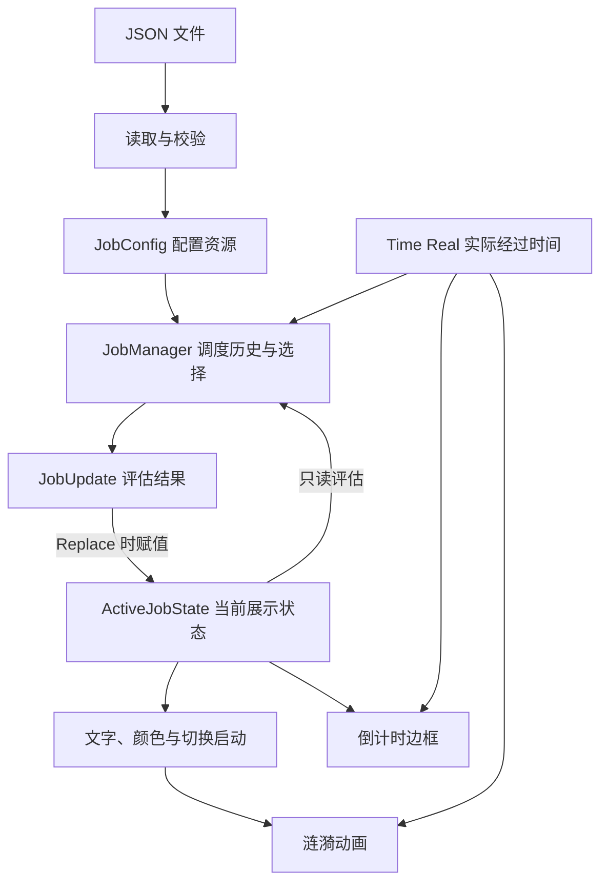

# Nyra 一阶段实现总结

记录日期：2026-09-09。实现基线：提交 `18aaf47`，应用版本 `0.1.0`。

本文依据该基线的源码、示例配置和本地检查结果整理，描述已实现能力，并单独列出尚未实现和待验证的部分；不表示早期规划的全部验收条件已满足。

## 1. 阶段定位与功能边界

Nyra 的长期目标是增强用户感知并提供应对方案。当前阶段交付的是 **配置驱动的短周期提醒浮窗**
：用户预先编写需要关注的事项，程序持续选择一项显示，以文字、主题色和倒计时边框帮助用户保持注意。

该能力适用于游戏中的操作习惯提醒，也可以用于其他桌面活动中的重复关注事项。提示内容与游戏进程没有自动关联；启动时间就是提醒运行的起点。

| 能力     | 当前实现                                                                      |
|----------|-------------------------------------------------------------------------------|
| 窗口     | 无标题栏、透明背景、固定 160 × 40、不可调整大小、始终置顶、设置隐藏任务栏按钮 |
| 拖动     | 窗口内按住左键，通过 `Window::start_drag_move()` 请求系统拖动                 |
| 提示     | 单行居中，系统 UI 字体，17 像素字号，长文本估算截断                           |
| 配置     | JSON 文件；启动时读取，可通过首个命令行参数指定路径                           |
| 调度     | 非抢占式展示；依据资格时间、间隔、配置位置确定下一项                          |
| 进度     | 沿圆角边框显示当前项剩余展示比例                                              |
| 配色     | 自定义主题色或按配置位置分配默认颜色；背景为加深后的半透明颜色                |
| 切换     | 提示切换时触发扩散与淡出涟漪，并重设边框起点                                  |
| 错误反馈 | 配置读取、解析、有效性检查失败时输出启动错误并返回失败退出码                  |

尚未实现：OCR、截图分析、游戏状态识别、动态应对方案、阶段手动推进、鼠标穿透、锁定模式、全局快捷键、暂停/恢复、配置热加载和位置持久化。

窗口化和无边框全屏属于兼容目标，但不能仅凭置顶属性认定所有游戏均已兼容。独占全屏覆盖不属于当前承诺。

## 2. 运行与日常使用

### 2.1 环境与启动

当前渲染后端固定为 DX12，面向 Windows 使用。代码使用 Rust 2024 edition；本次验证环境为 Rust 1.95.0，`Cargo.lock` 中 Bevy 为
0.19.1。`Cargo.toml` 尚未声明 `rust-version`，本文不对更低版本工具链作兼容承诺。

从项目目录运行示例配置：

```powershell
cargo run --locked
```

指定其他 JSON 文件：

```powershell
cargo run --locked -- "D:\Configs\nyra.json"
```

构建发行版本并显式传入配置：

```powershell
cargo build --release --locked
.\target\release\nyra.exe ".\config.json"
```

以上发行构建命令为使用说明，本次未执行发行构建。首次构建需要取得依赖，包括 `Cargo.toml` 中固定 Git revision 的 `arrayref`
补丁；已有完整缓存时才可使用 `--offline`。

默认路径为 `config.json`，相对路径均相对于 **进程工作目录**解析。将 `nyra.exe`
复制到其他目录不会自动改变配置查找规则；通过快捷方式启动时应设置工作目录或传入绝对配置路径。

### 2.2 使用步骤

1. 编辑配置，为每条提醒填写简短单行文字、冷却间隔及可选展示时长和颜色。
2. 启动程序，等待出现浮窗。首项由调度规则决定，不一定是数组第一项。
3. 在浮窗内按住鼠标左键，将其拖到适合观察的位置。
4. 当前提示按 `showTime` 展示，边框持续变化；到期后选择下一项。
5. 修改配置后结束程序并重新启动；调度历史会重新开始。

当前没有应用内退出按钮、托盘菜单或专用退出快捷键。从终端启动时可返回启动终端按 `Ctrl+C`；必要时也可在任务管理器结束
`nyra.exe`。上述退出方式未在本次文档任务中逐项实测。

由于没有鼠标穿透，使用时应把浮窗放在较少点击的位置。拖动后的位置不会保存。

## 3. 配置说明

配置模型见 [job.rs](../src/job.rs)，读取与校验见 [main.rs](../src/main.rs)。

```json
{
  "tips": [
    {
      "tip": "保持侦察",
      "interval": 8,
      "showTime": 5,
      "color": "#33E078"
    },
    {
      "tip": "持续生产",
      "interval": 6
    }
  ]
}
```

| 字段              | 类型与约束                                             | 默认行为                   |
|-------------------|--------------------------------------------------------|----------------------------|
| `tips`            | 数组，至少一项                                         | 必填                       |
| `tips[].tip`      | 字符串，去除首尾空白后不能为空                         | 必填；校验不修改原始字符串 |
| `tips[].interval` | `u64`，大于零，单位秒                                  | 必填                       |
| `tips[].showTime` | 可选 `u64`，指定有效数值时须大于零，单位秒             | 省略或 `null` 使用 5 秒    |
| `tips[].color`    | 可选字符串，严格为 `#RRGGBB`，十六进制字母不区分大小写 | 省略或 `null` 使用默认色板 |

实际文本字段是 `tip`，不是 `tipString`。JSON 不支持注释和尾随逗号。负数、小数或字符串形式的时间不符合当前反序列化类型。

当前未启用未知字段拒绝：额外字段会被忽略。例如把 `showTime` 拼成其他名称，可能直接使用默认 5
秒，而不是报告拼写错误。换行也未被配置校验拒绝，但显示目标为单行，建议避免换行和过长内容。

默认色板按提示在数组中的索引循环分配：

```text
#33E078 → #4DA3FF → #A879FF → #FFB347 → #FF6685 → #37D6D0 → 循环
```

自定义颜色不会改变其他提示按索引获得的默认颜色。

窗口大小、17 像素字号、15 列截断阈值、边框宽度、透明度和动画时间均是代码设定，尚不是 JSON
配置项。主要参数集中于 [settings_default_values.rs](../src/settings_default_values.rs)
，文字参数另见 [main.rs](../src/main.rs) 和 [view.rs](../src/sensory/tip_overlay/view.rs)。

## 4. 调度语义与示例

### 4.1 时间与选择规则

`showTime` 是本轮计划展示时长。调度只在到期时选择下一项，其他项中途获得资格不会打断当前展示。

对已经展示结束的提示：

```text
下次资格时间 = 上次实际处理展示结束的时间 + interval
```

尚未展示结束过的提示，其资格时间视为零。每轮选择规则为：

1. 排除刚完成的当前项。
2. 保留资格时间不晚于当前时间的候选项。
3. 按 `(资格时间, interval, 配置索引)` 升序选择第一项。
4. 没有其他候选项时，立即重复当前项。

`interval` 因而不是严格的出现周期，也不是禁止重复的硬限制。`showTime` 可以大于 `interval`
；当前项重复时同样产生新的展示起止时间。只有一项时，该项会持续逐轮展示。

选择采用线性遍历，单次选择为 O (n)，运行历史为 O (n)。对当前少量提示的使用方式，这一实现便于理解和验证。

### 4.2 仓库示例配置的轮转

以 [config.json](../config.json) 为例：

| 提示  | `interval` | `showTime` |
|-------|------------|------------|
| TIP 1 | 8 秒       | 8 秒       |
| TIP 2 | 6 秒       | 6 秒       |
| TIP 3 | 8 秒       | 默认 5 秒  |

以首次调度为 0 秒，假设每次均在截止时间准时更新：

| 时间段   | 展示项 | 选择原因                                                             |
|----------|--------|----------------------------------------------------------------------|
| 0–6 秒   | TIP 2  | 三项资格时间均为零，TIP 2 的间隔最短                                 |
| 6–14 秒  | TIP 1  | TIP 1、TIP 3 均自启动具备资格，间隔相同，TIP 1 配置在前              |
| 14–19 秒 | TIP 3  | TIP 3 资格时间为零，早于 TIP 2 的 12 秒，即使 TIP 2 间隔更短也不优先 |
| 19–25 秒 | TIP 2  | TIP 2 已在 12 秒获得资格；TIP 1 要等到 22 秒                         |
| 25–33 秒 | TIP 1  | TIP 1 资格时间为 22 秒；TIP 3 要等到 27 秒                           |
| 33–38 秒 | TIP 3  | TIP 3 资格时间为 27 秒，早于 TIP 2 的 31 秒                          |

这说明程序既不是始终按配置顺序轮转，也不是始终选择最短间隔项。等待资格最久的候选项优先，有助于避免其他提示被短间隔项持续压住。

### 4.3 延迟更新与下一项预测

调度、倒计时和动画使用 `Time<Real>`。若应用卡顿，调度在恢复后的更新中处理一次到期，再从该时刻启动下一轮；不会在一帧内补播所有错过的轮次。实际展示可能超过计划时长，因此本程序不是严格实时计时器。

`preview_next_index` 在本轮开始时，以预计结束时间计算。实际结束处理使用当时的真实时间重新选择；长时间延迟可能使更多提示获得资格，造成预告颜色与实际下一项不同。

## 5. 实现架构

### 5.1 模块职责与数据流

项目保持单 crate，通过 Rust 模块和一个 Bevy 插件组织代码。

| 模块                                                                | 职责                                                 |
|---------------------------------------------------------------------|------------------------------------------------------|
| [main.rs](../src/main.rs)                                           | 命令行路径、配置读取与校验、渲染环境、窗口及应用装配 |
| [job.rs](../src/job.rs)                                             | JSON 数据类型、默认展示时长、颜色校验和默认色板解析  |
| [settings_default_values.rs](../src/settings_default_values.rs)     | 窗口与视觉默认常量                                   |
| [sensory/mod.rs](../src/sensory/mod.rs)                             | `SensoryPlugin`，初始化调度资源并注册浮窗系统        |
| [job_manager.rs](../src/sensory/job_manager.rs)                     | 调度历史、资格选择、展示结果与调度测试               |
| [tip_overlay.rs](../src/sensory/tip_overlay.rs)                     | Startup/Update 系统注册、执行顺序与运行条件          |
| [view.rs](../src/sensory/tip_overlay/view.rs)                       | 实体创建、文字和颜色同步、文本截断及拖动             |
| [transition.rs](../src/sensory/tip_overlay/transition.rs)           | 提示切换时重设边框起点并启动涟漪                     |
| [progress_border.rs](../src/sensory/tip_overlay/progress_border.rs) | 圆角边框路径缓存和剩余进度网格更新                   |
| [ripple.rs](../src/sensory/tip_overlay/ripple.rs)                   | 涟漪状态、扩散网格与淡出更新                         |
| [geometry.rs](../src/sensory/tip_overlay/geometry.rs)               | 圆角轮廓、三角网格及射线边界计算                     |
| [style.rs](../src/sensory/tip_overlay/style.rs)                     | 颜色解析、背景加深、透明材质及颜色赋值               |



`JobConfig` 保存配置；`JobManager` 保存每项的完成时间；`ActiveJobState` 保存可供显示层读取的当前索引、预计下一索引、开始和结束时间。调度逻辑不操作文本、材质或窗口。

### 5.2 状态提交与 Bevy 变更检测

`JobManager::eval_update_at()` 接收 `&ActiveJobState`，返回：

```rust
enum JobUpdate {
    Unchanged,
    Replace(Option<ActiveJob>),
}
```

它只读展示状态，但仍会更新 `JobManager` 自身的历史，所以不是纯函数。`process_jobs` 是展示状态的提交位置：

```rust
let update = manager.eval_update_at( & config, & state, time.elapsed());
if let JobUpdate::Replace(next) = update {
state.active_job = next;
}
```

只有赋值时才通过 `ResMut<ActiveJobState>` 的 `DerefMut` 自动标记变化；普通未到期帧不取得该资源内部的可变引用。此路径不使用
`bypass_change_detection()` 或 `set_changed()`。

重复当前项仍会改变展示起止时间，因此也应标记变化。`Replace(None)` 支持清空活动状态；正常启动配置禁止空列表，且当前没有热加载入口，这一分支不是用户可操作的清空功能。

### 5.3 系统执行顺序

启动阶段由 `setup_overlay` 创建相机、背景、文字、边框、涟漪及几何缓存。每次 Update 的主要顺序如下：

```text
process_jobs
    ↓
共享 resource_changed::<ActiveJobState> 条件的系统组
    sync_tip_text → sync_tip_colors → begin_tip_transition
    ↓
animate_ripple
    ↓
update_countdown_border
```

外层和组内均用 `.chain()` 保持顺序。运行条件统一放在注册处，三个消费者没有重复的 `is_changed()`
guard。状态未变化时整组跳过；动画和边框继续按时间更新。`drag_overlay` 单独注册于 Update，没有加入这条顺序链。

运行条件控制的是系统执行，不代表渲染循环已经按需休眠。多个显示系统共享可变资产资源，因此当前没有为提高并行度拆散这些顺序。

## 6. 窗口与视觉实现

### 6.1 透明窗口

应用设置透明清屏、无装饰窗口、`AlwaysOnTop`、`skip_taskbar` 和预乘 Alpha 合成。渲染器固定选择 DX12；Windows 启动路径在创建
Bevy 应用前设置 `WGPU_DX12_PRESENTATION_SYSTEM=visual`，用于当前透明呈现方案。

该设置集中在 `main.rs`，没有引入手写 Win32 拖动、进程注入或图形 API hook。实际透明、置顶和游戏覆盖效果仍需在目标显示环境验证。

### 6.2 混合渲染

文字使用 Bevy UI `Node` 与 `Text`；背景、边框和涟漪使用 `Camera2d`、`Mesh2d`、`ColorMaterial`。网格层次由 Z 值区分：背景 0、涟漪
0.5、已播放边框 1、倒计时边框 2。

剩余边框覆盖在完整的下一项颜色边框之上。随着剩余部分缩短，下层颜色显露，形成当前到下一项的视觉预告。背景 RGB 为当前主题色的
0.18 倍，Alpha 为 0.60。

边框以圆角轮廓中心线的累计长度归一化进度。路径被缓存，日常更新复用末端顶点，只有可见线段拓扑改变时调整索引。此设计减少 CPU
侧重复计算，但不等于 GPU 只上传被修改的两个顶点。

### 6.3 涟漪与文本

涟漪状态为 `Idle → Expanding → Fading → Idle`。扩散持续 360 毫秒，淡出持续 240 毫秒。切换时从边框随机位置开始，预先计算各射线到圆角边界的距离，让扩散限制在浮窗内。

`animate_ripple` 用 `match` 处理阶段，`Idle` 直接返回。仅在阶段切换时写入 `phase`
；外层循环允许扩散结束后同帧进入淡出，保留延迟帧的时间衔接。同一提示重复时通常不重播涟漪；启动实体先以配置第一项初始化，首个调度结果由
Update 同步。

文本使用 Unicode 字符显示宽度累计，超过 15 列时保留最多 12 列并追加 `...`，另有 136
像素最大宽度和裁切。它不是精确字形测量，也未按完整字素簇截断，宽字形、组合字符、表情及不同 DPI 下仍可能出现裁切差异。当前没有查看全文或滚动入口。

## 7. 验证记录与待验收项目

### 7.1 本次自动检查

2026-09-09，在上述实现基线与现有依赖缓存上执行：

| 检查                                                          | 结果                                                                                   |
|---------------------------------------------------------------|----------------------------------------------------------------------------------------|
| `cargo test --offline --quiet`                                | 4 项通过，0 失败                                                                       |
| `cargo clippy --offline --quiet --all-targets -- -D warnings` | 未通过：`main.rs` 两处 `u64 <= 0` 比较触发 `absurd_extreme_comparisons`，应写为 `== 0` |

四项测试覆盖资格时间优先、不提前结束展示、相同条件下的配置顺序，以及真实 Bevy 调度中状态提交时的变更检测。最后一项包括普通帧、重复当前项、切换和清空状态。

这些测试没有创建真实渲染窗口，也没有覆盖完整显示系统组、涟漪视觉效果或系统级交互。测试通过不能代替桌面验收。Clippy
问题是现有源码问题，本次文档整理不修改其实现。

### 7.2 人工验收清单

以下均为待执行项目，未在本次文档任务中实测：

- [ ] 从项目目录启动，以及从其他工作目录用绝对配置路径启动。
- [ ] 验证透明圆角、普通窗口上的置顶及任务栏隐藏行为。
- [ ] 验证拖动、焦点变化和多显示器移动。
- [ ] 在窗口化及无边框全屏目标游戏中验证覆盖效果和鼠标拦截范围。
- [ ] 对照示例时间表观察轮转、进度边框和下一项颜色。
- [ ] 验证单条提示重复、自定义颜色、默认颜色及长中文文本。
- [ ] 验证不同 DPI、宽字形、表情和组合字符的显示。
- [ ] 验证长帧、拖动阻塞或休眠恢复后的轮转与动画。
- [ ] 测量聚焦、失焦及动画期间的 CPU/GPU 占用和更新频率。
- [ ] 验证终端退出方式，以及缺失配置、非法 JSON 和非法字段值的诊断。

## 8. 分析与后续优化方向

当前适合保留的设计包括单 crate、调度与表现分离、基于 `Duration` 的实际时间处理、显式系统顺序和几何缓存。近期已经落实：展示状态仅提交时可变访问、涟漪
Idle 提前返回，以及消费者共享资源变更运行条件。

后续建议按使用收益逐项推进，以下均未视为已实现：

| 顺序 | 建议                            | 理由与范围                                                                                   |
|------|---------------------------------|----------------------------------------------------------------------------------------------|
| 1    | 补齐锁定/鼠标穿透及可靠恢复入口 | 直接改善游戏操作；应同时解决进入穿透后如何恢复交互                                           |
| 2    | 测量并明确刷新策略              | 当前未设置 `WinitSettings`；应根据动画和倒计时需求设置有界唤醒，不能直接采用长等待而影响轮转 |
| 3    | 集中配置转换与校验              | 启动时解析颜色、默认值和时间类型；考虑拒绝未知字段并修正 Clippy 问题                         |
| 4    | 完善文字阅读与日常控制          | 保证长提示可读，增加清晰退出入口；依据使用需求决定暂停、尺寸配置或位置保存                   |
| 5    | 补充边界测试与性能测量          | 覆盖配置错误、延迟更新、几何边界及实际显示系统条件；先测量再考虑 shader 或 feature 裁剪      |

运行时颜色预解析、相同文本/材质值不重复写入、Bevy feature 精简等仍是可选优化，没有在本次阶段总结中计作完成。当前尚无性能实测数据，不对其收益作量化承诺。

## 9. 与早期规划的关系

| 早期规划                     | 当前实现                                 |
|------------------------------|------------------------------------------|
| TOML、`title/duration/lines` | JSON、`tip/interval/showTime/color`      |
| 多行阶段内容                 | 单行短提示                               |
| 按阶段顺序推进               | 按展示资格时间优先调度，必要时重复当前项 |
| Editing/Locked、鼠标穿透     | 尚未实现，仅支持拖动                     |
| 配置窗口初始尺寸             | 固定代码常量                             |
| 响应式低功耗更新             | 尚未配置专门刷新策略，资源占用待测       |

后续维护以本总结和 README 作为当前行为说明；早期规划用于理解设计背景。新增功能或改变调度语义时，应同时更新使用说明、示例与对应验收记录。
